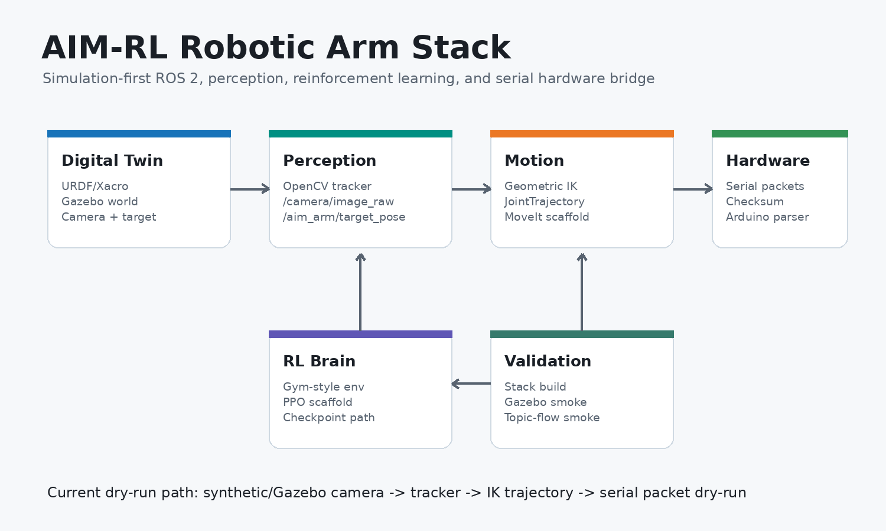
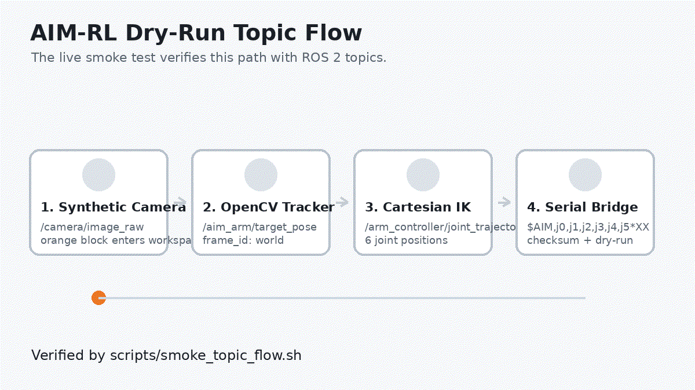
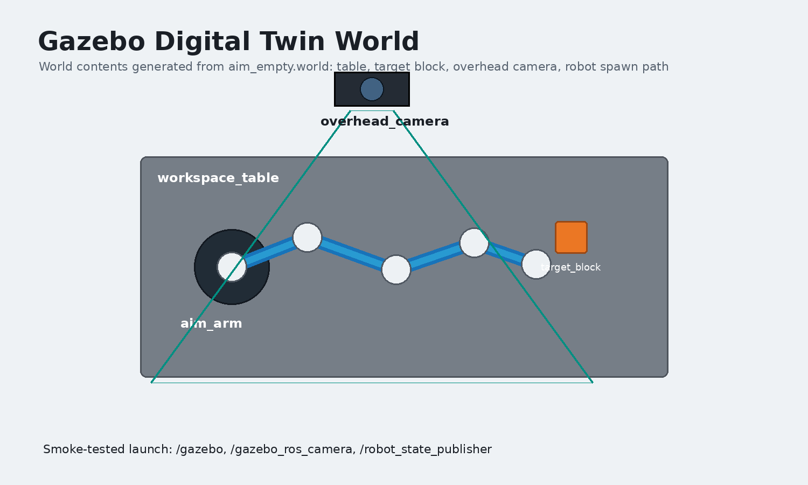
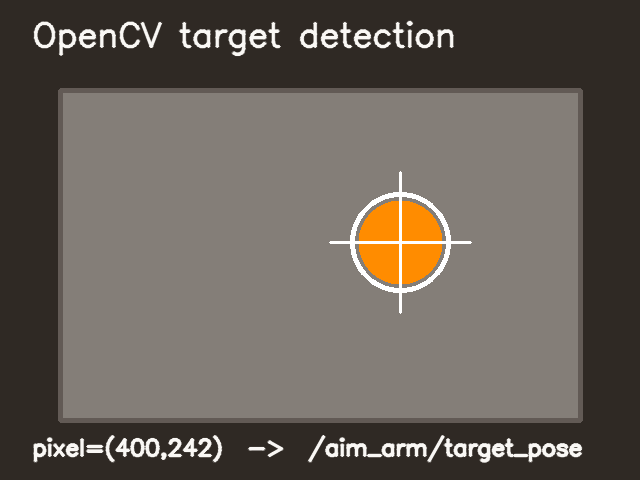
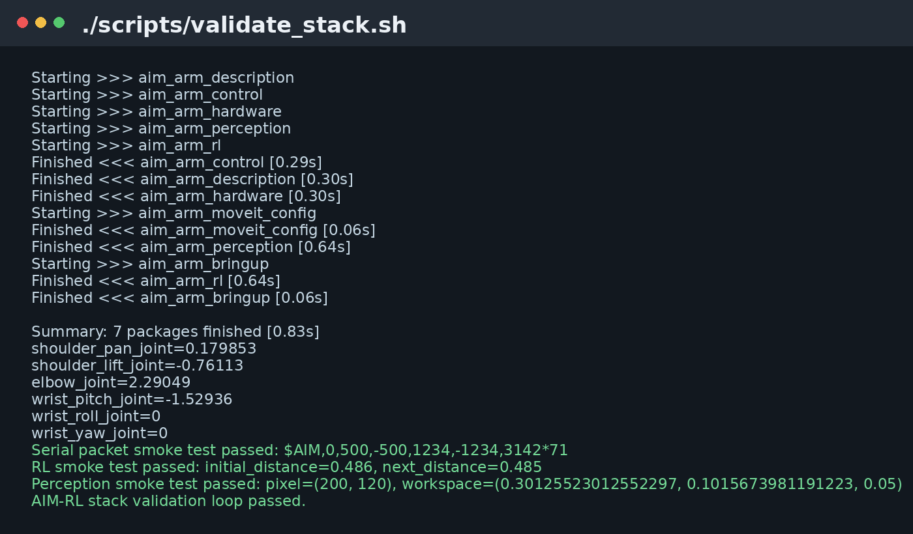
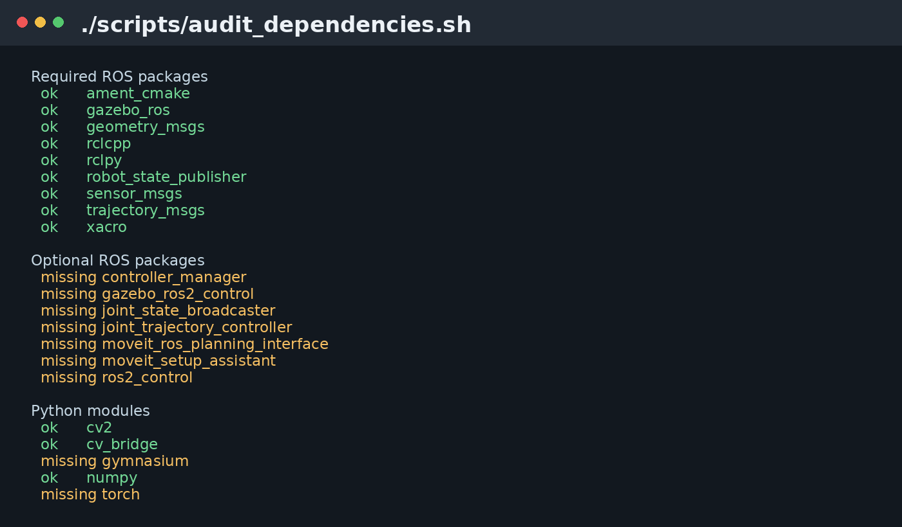
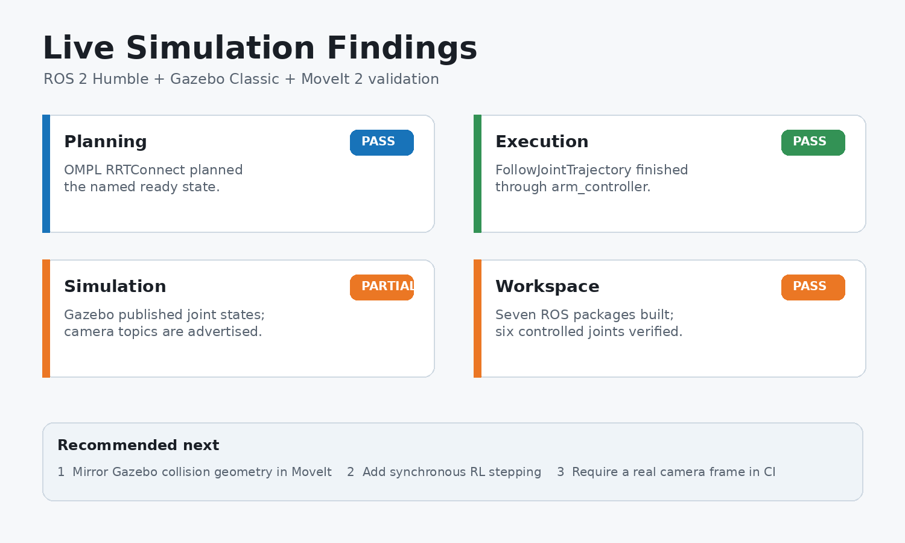

# AIM-RL

**Simulation-first AI robotic arm stack for ROS 2, Gazebo, perception, reinforcement learning, MoveIt planning scaffolds, and serial hardware deployment.**



## What This Is

AIM-RL is a full robotic-arm software stack built to let the robot mature in simulation before hardware money is spent. It already contains a 6-DOF digital twin, Gazebo world, camera perception pipeline, C++ Cartesian command node, RL environment scaffolding, MoveIt configuration scaffold, dry-run hardware bridge, Arduino packet parser, and automated smoke tests.

The current validated path is:

```text
synthetic or Gazebo camera -> OpenCV target tracker -> Cartesian IK -> JointTrajectory -> serial packet dry-run
```



## Highlights

- **ROS 2 Humble workspace** with seven packages.
- **6-DOF URDF/Xacro digital twin** with inertials, collisions, limits, Gazebo tags, and optional `ros2_control`.
- **Gazebo Classic world** with table, target block, overhead camera, and robot spawn launch.
- **OpenCV perception** that turns camera frames into `/aim_arm/target_pose`.
- **C++ motion command node** that publishes six-joint trajectories from Cartesian targets.
- **RL bridge** with Gym-style environment, reward logic, clipped PPO training, metrics, and checkpoint evaluation.
- **MoveIt planning pipeline** with SRDF, OMPL, KDL, RViz MotionPlanning, and simulated plan execution.
- **Hardware bridge** that clamps joint commands and emits checksum-protected serial packets.
- **Arduino firmware scaffold** for parsing laptop-to-microcontroller command packets.
- **End-to-end smoke tests** for build, Gazebo launch, bringup, and camera-to-trajectory topic flow.

## Screenshots

| Gazebo World | Perception |
| --- | --- |
|  |  |

| Validation | Dependency Audit |
| --- | --- |
|  |  |

## Simulation Evidence and Findings

| Gazebo workcell definition | Validated findings |
| --- | --- |
|  |  |

The workcell image is reproducibly generated from the tracked world definition. The validation card summarizes live ROS 2, Gazebo, controller, and MoveIt checks. See [findings and recommendations](docs/findings_and_recommendations.md) for the evidence, the WSLg camera-rendering limitation found during capture, and prioritized next work.

## Repository Map

```text
colcon_ws/src/
  aim_arm_description      URDF/Xacro, RViz, Gazebo launch, world, camera, target
  aim_arm_control          C++ Cartesian target -> JointTrajectory node
  aim_arm_perception       OpenCV detector, tracker node, synthetic camera node
  aim_arm_rl               Gym-style environment, reward logic, PPO scaffold
  aim_arm_hardware         Serial bridge and packet encoder
  aim_arm_bringup          Dry-run software pipeline launch
  aim_arm_moveit_config    MoveIt planning scaffold

firmware/
  aim_arm_serial_driver    Arduino packet parser scaffold

scripts/
  run_all_checks.sh        Full local verification loop
  validate_stack.sh        Build + XML + smoke checks
  smoke_gazebo_launch.sh   Gazebo launch smoke test
  smoke_bringup.sh         Dry-run node smoke test
  smoke_topic_flow.sh      Camera -> target -> trajectory smoke test
```

## Quick Start

```bash
cd /home/paneendra/AIM-RL
./scripts/run_all_checks.sh
```

Run the dry-run software pipeline:

```bash
source /opt/ros/humble/setup.bash
source colcon_ws/install/setup.bash
ros2 launch aim_arm_bringup software_pipeline.launch.py
```

Run Gazebo:

```bash
source /opt/ros/humble/setup.bash
source colcon_ws/install/setup.bash
ros2 launch aim_arm_description gazebo.launch.py
```

Run Gazebo with controller spawning after ROS optional dependencies are installed:

```bash
source /opt/ros/humble/setup.bash
source colcon_ws/install/setup.bash
ros2 launch aim_arm_description controlled_gazebo.launch.py
```

Visualize the robot in RViz:

```bash
source /opt/ros/humble/setup.bash
source colcon_ws/install/setup.bash
ros2 launch aim_arm_description display.launch.py
```

## Validation

Full local verification:

```bash
./scripts/run_all_checks.sh
```

Individual checks:

```bash
./scripts/validate_stack.sh
./scripts/audit_dependencies.sh
./scripts/smoke_gazebo_launch.sh
./scripts/smoke_controlled_gazebo.sh
./scripts/smoke_controlled_trajectory.sh
./scripts/smoke_moveit_planning.sh
./scripts/smoke_moveit_execution.sh
./scripts/smoke_bringup.sh
./scripts/smoke_topic_flow.sh
./scripts/smoke_rl_training.sh
./scripts/write_dependency_report.sh
```

The full loop currently validates:

- URDF generation and XML structure.
- Optional `ros2_control` XML expansion.
- Gazebo world XML.
- MoveIt SRDF planning group.
- MoveIt OMPL pipeline and trajectory-controller mapping.
- `colcon build --symlink-install`.
- C++ IK smoke test.
- Serial packet smoke test.
- RL environment smoke test.
- OpenCV perception smoke test.
- Gazebo launch.
- Controlled Gazebo launch and controller spawning when ROS 2 control packages are installed.
- Controlled trajectory command acceptance and `/joint_states` publication.
- MoveIt `move_group` startup when MoveIt 2 is installed.
- MoveIt plan execution through the simulated arm controller.
- Dry-run bringup.
- Synthetic camera to trajectory topic flow.
- PPO rollout training, checkpoint save, and policy evaluation when PyTorch is installed.

## Optional Dependencies

The stack is useful without optional dependencies, but advanced live modes need them:

```bash
./scripts/install_optional_dependencies.sh
```

This installs ROS 2 control, Gazebo ROS 2 control, MoveIt, and CPU-safe Python RL dependencies from `requirements-rl-cpu.txt`.

Install only ROS optional dependencies:

```bash
./scripts/install_ros_optional_dependencies.sh
```

Install only Python RL dependencies:

```bash
./scripts/install_rl_cpu_dependencies.sh
```

Current dependency status:

```bash
./scripts/audit_dependencies.sh
```

## Serial Packet Contract

Laptop-to-microcontroller packets use integer milliradians and an XOR checksum:

```text
$AIM,j0,j1,j2,j3,j4,j5*XX\n
```

Example:

```text
$AIM,0,500,-500,1234,-1234,3142*71
```

Joint commands are clamped to robot limits before encoding.

## Media Generation

README images and the topic-flow GIF are reproducible:

```bash
./scripts/generate_readme_media.py
```

Generated assets live in:

```text
media/screenshots/
media/recordings/
```

## Status

Tracked in [docs/status.md](docs/status.md).

Currently validated:

- Seven ROS 2 packages build locally.
- Gazebo camera world launches.
- Synthetic perception pipeline produces trajectories.
- Hardware bridge produces dry-run serial packets.
- MoveIt plans and executes trajectories through controlled Gazebo.

Current blockers for advanced live execution:

- Physical serial write verification needs a connected microcontroller.

## Documentation

- [Bringup](docs/bringup.md)
- [Dependencies](docs/dependencies.md)
- [MoveIt](docs/moveit.md)
- [Artifacts](docs/artifacts.md)
- [Project Status](docs/status.md)
- [Findings and Recommendations](docs/findings_and_recommendations.md)
- [Phase 1 Digital Twin](docs/phase1_week1_2.md)
- [Phase 1 Motion Node](docs/phase1_week5_6.md)
- [Phase 2 RL Bridge](docs/phase2_week7_8.md)
- [Phase 2 PPO Scaffold](docs/phase2_week9_14.md)
- [Phase 3 Perception](docs/phase3_week15_18.md)
- [Phase 4 Hardware Bridge](docs/phase4_week19_24.md)

## Roadmap

- Synchronize Gazebo workcell collision objects into the MoveIt planning scene.
- Replace the mock RL backend with a ROS/Gazebo stepping backend.
- Add TensorBoard reward and success-rate visualization.
- Map Arduino parsed commands to selected actuator hardware.
- Add real camera calibration or depth-based target estimation.

## License

MIT. See [LICENSE](LICENSE).
